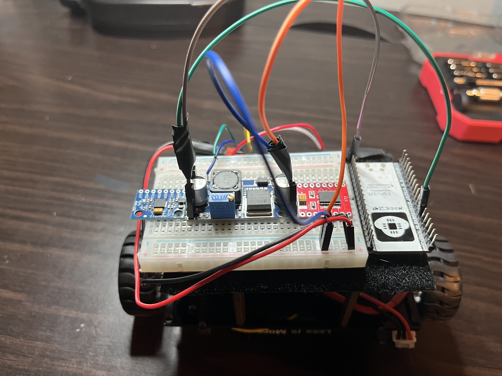
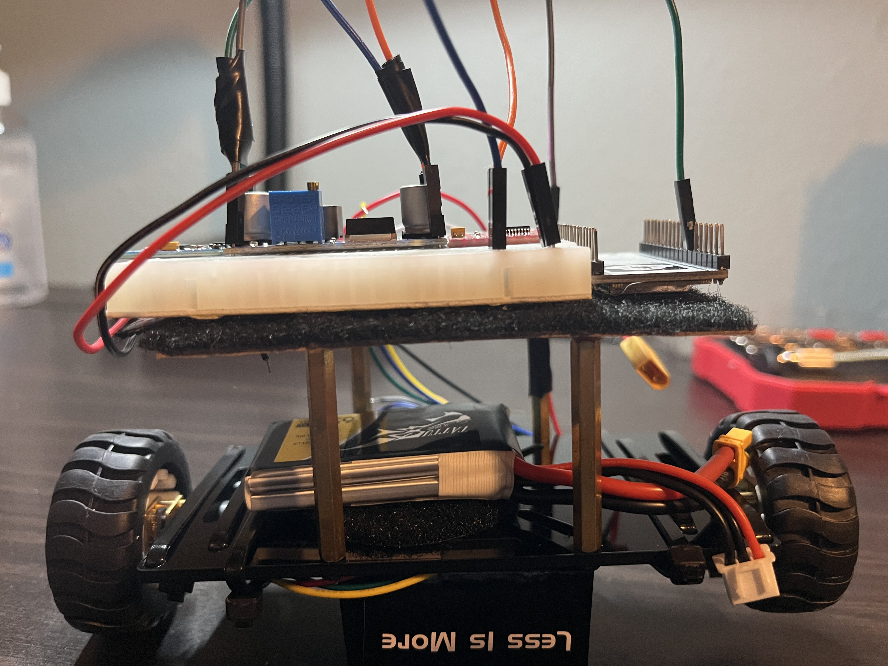
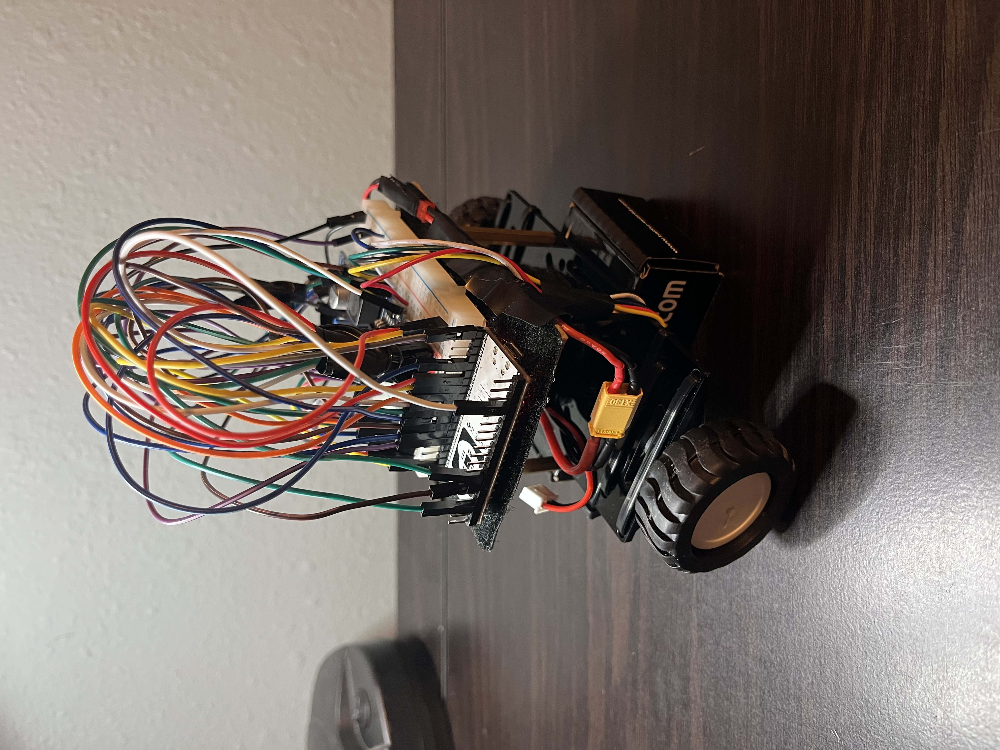

# Self-Balancing-Robot
Two-wheel self-balancing robot using ESP32, MPU6050, TB6612FNG motor driver, N20 gear motors, and encoders
## About
A two-wheel self-balancing robot that is controlled using an ESP32. Powered by 7.4V LiPo battery and uses an MPU6050 to measure its pitch angle. Motor speed is then adjusted to keep itself balanced
## Features 
- MPU6050 IMU pitch measurement
- Complementary filter
- PID-style balancing control
- Wheel encoders
- PWM motor speed control
- Two-Wheel self-balancing
- Safety cutoff
## Hardware
- ESP32
- MPU6050 GY-521
- TB6612FNG motor driver
- 2 * N20 DC gear motors
- 2 * wheel encoders
- LM2596 buck converter
- 7.4V 2S 650mAh LiPo battery
## Images

### Components and Setup

### Chassis and Battery

### Final Robot

### Circuit Schematic

